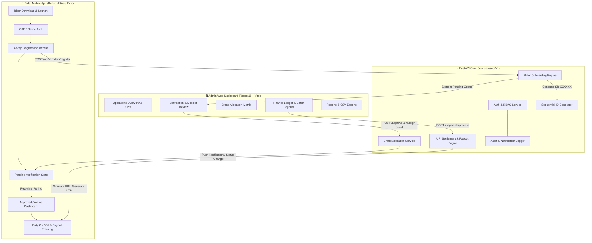

# ⚡ Super Riders — Production Rider Management & UPI Settlement Platform

<p align="center">
  
  
  
  
  
  
</p>

---

## 📖 Executive Summary

**Super Riders** is an enterprise-grade fleet management, rider onboarding lifecycle, multi-brand logistics allocation, and UPI payment settlement platform.

The system is engineered as a unified full-stack solution serving two core experiences:
1. **Rider Mobile App (iOS & Android)**: Built with **React Native (Expo SDK 52)**, allowing delivery executives to register in a guided 4-step wizard, submit KYC documents, track approval status in real-time, view assigned delivery brand partnerships, toggle duty status, and monitor earnings with instant UPI payouts.
2. **Admin Web Operations Dashboard**: Built with **React 18 & Vite**, offering logistics operators, fleet managers, and finance teams full operational visibility with real-time fleet analytics, approval queues, brand allocation matrix, instant/batch UPI settlements with UTR tracking, and immutable audit logging.
3. **Backend REST API**: Built with **FastAPI & SQLAlchemy**, offering asynchronous database access, sequential Rider ID generation (`SR-000001` format), JWT role-based access control (RBAC), and automated settlement simulation.

---

## 🌟 Key Features

### 🛵 1. Rider Mobile App (Cross-Platform iOS & Android)
- **Guided 4-Step Registration Wizard**:
  - *Personal Info*: Full Name, Mobile, Email, Date of Birth, Profile Avatar, Government ID.
  - *Work Profile*: Current delivery company (Zomato, Swiggy, Zepto, Blinkit, Shadowfax), vehicle type (EV, Petrol Bike, Bicycle), vehicle registration number, driving license.
  - *Working Locations*: Preferred operating cities, delivery zones, and primary hubs.
  - *Payment Details*: UPI ID (e.g. `rider@okaxis`), Google Pay number, Account holder name, and IFSC code.
- **Sequential Rider Identification**: Every rider is issued a unique company identifier (e.g., `SR-000001`, `SR-000145`) upon submission.
- **Real-Time Verification Screen**: Polls backend state dynamically and alerts the rider when their account is reviewed, approved, or brand-assigned.
- **Active Rider Home Screen**:
  - Assigned Brand Partnership card with contract details.
  - Live Duty Switch (`Online` / `Offline`).
  - Today's Deliveries, Active Hours, and Estimated Earnings.
- **Earnings & UPI Payout Ledger**:
  - Weekly and monthly earnings breakdown.
  - Complete history of settlements with UTR reference numbers, payment mode (`UPI` / `GPay`), timestamp, and receipt generation.
- **Digital Rider ID & Profile**:
  - Digital Fleet Badge with embedded QR code.
  - Direct emergency SOS and operations support hotline.

---

### 🖥️ 2. Admin Operations & Finance Dashboard
- **Executive Analytics Overview**:
  - Real-time KPI tiles: Total Fleet Size, Pending Review Queue, Total Payout Volume (₹), and Active Partner Brands.
  - Interactive SVG trend charts: 7-day registration velocity, 30-day payout volume, and brand market distribution.
- **Rider Verification & Dossier Review Queue**:
  - Advanced search and multi-criteria filters (by Status, City, Brand, Vehicle Type).
  - Comprehensive **Rider Dossier Modal**: view submitted government IDs, driving license, vehicle details, and UPI information.
  - One-click workflow actions: **Approve Rider**, **Reject Application**, **Put on Hold**, or **Blacklist**.
- **Multi-Brand Fleet Allocation Matrix**:
  - Brand partner CRUD (e.g., Brand A through E, Zomato, Swiggy, Zepto, Blinkit).
  - Active fleet count per brand, contract commission percentages, and payout models.
  - Single and bulk brand assignment modal with automatic notification dispatch.
- **Finance & UPI Payout Engine**:
  - Instant settlement trigger with custom or full amount.
  - Batch payout execution for entire approved fleet.
  - Unique transaction identifier generation (`TXN-YYYYMMDD-XXXXXX`) and bank UTR tracking.
  - Filter ledger by `PAID`, `PROCESSING`, `PENDING`, or `FAILED`.
- **Audit Trail & Governance Log**:
  - Immutable audit logs recording actor email, action type, target entity ID, IP address, and timestamp.
- **Embedded Interactive Mobile Simulator**:
  - Test the entire mobile user experience directly within the browser dashboard via a virtual smartphone frame.

---

## 📐 System Architecture & Workflow



---

## 🎨 UI & Design System

The platform follows a modern, high-contrast **Obsidian & Deep Navy** design system engineered for high-density logistics monitoring:

| Component | Design Specification | Details |
| :--- | :--- | :--- |
| **Color Palette** | Navy Obsidian (`#0f172a`), Slate Card (`#1e293b`), Electric Blue (`#3b82f6`), Emerald Success (`#10b981`), Amber Caution (`#f59e0b`), Rose Reject (`#ef4444`) | Curated dark-mode theme preventing eye strain during operations monitoring |
| **Typography** | Inter, Plus Jakarta Sans, SF Pro Display / System Sans | Clean, legible sans-serif with distinct numeric tabular figures for currency and counts |
| **Data Tables** | High-density tables with inline status pill badges, quick action menus, and pagination | Allows review of hundreds of riders in minimal screen real-estate |
| **Mobile Experience**| Ergonomic bottom navigation, card-based statistics, native haptics-ready touch targets (48px+) | Designed for one-handed operation by delivery executives on the road |

---

## 📂 Project Structure

```text
Super-Riders/
├── backend/                      # FastAPI Python Backend
│   ├── app/
│   │   ├── api/
│   │   │   ├── deps.py           # Dependency injection (DB session, JWT auth)
│   │   │   └── v1/
│   │   │       ├── api.py        # Central API router
│   │   │       └── endpoints/
│   │   │           ├── auth.py          # Admin & Rider Authentication
│   │   │           ├── riders.py        # Rider profile & registration endpoints
│   │   │           ├── admin_riders.py  # Review queue, approvals, rejections
│   │   │           ├── brands.py        # Partner brand management & assignment
│   │   │           ├── payments.py      # UPI payouts & settlement ledger
│   │   │           ├── reports.py       # Metrics calculation & CSV export
│   │   │           ├── notifications.py # In-app notification feeds
│   │   │           └── audit_logs.py    # Compliance & audit trail endpoints
│   │   ├── core/
│   │   │   ├── config.py         # App settings & environment resolution
│   │   │   ├── database.py       # SQLAlchemy engine & session factory
│   │   │   └── security.py       # Password hashing & JWT generation
│   │   ├── models/
│   │   │   └── all_models.py     # SQLAlchemy models (Rider, Brand, Payment, etc.)
│   │   ├── schemas/
│   │   │   └── all_schemas.py    # Pydantic v2 validation models
│   │   ├── services/             # Core business logic services
│   │   └── main.py               # FastAPI application entrypoint
│   ├── tests/
│   │   ├── conftest.py           # Pytest fixtures and test database setup
│   │   └── test_super_riders.py  # End-to-end integration test suite
│   ├── reset_clean_db.py         # Resets database to clean slate for live testing
│   ├── seed_data.py              # Seeds database with realistic demo fleet
│   ├── requirements.txt          # Python dependencies
│   └── .env.example              # Environment variables template
│
├── frontend/                     # Admin Web Dashboard (Vite + React 18)
│   ├── src/
│   │   ├── components/           # Reusable UI components (Sidebar, Topbar, Simulator)
│   │   ├── views/                # Full-page operational views:
│   │   │   ├── DashboardView.jsx # KPIs, charts, quick actions
│   │   │   ├── RidersView.jsx    # Rider fleet table & dossier modal
│   │   │   ├── BrandsView.jsx    # Brand allocation & commission matrix
│   │   │   ├── PaymentsView.jsx  # Payouts ledger & settlement modal
│   │   │   ├── ReportsView.jsx   # Analytics charts & CSV data export
│   │   │   ├── AuditLogsView.jsx # System audit log
│   │   │   └── SettingsView.jsx  # Configuration & policies
│   │   ├── services/
│   │   │   └── api.js            # Axios client with automatic auth headers
│   │   ├── App.jsx               # Navigation router & state manager
│   │   ├── main.jsx              # React DOM entrypoint
│   │   └── index.css             # Design tokens, variables, and utility classes
│   ├── index.html                # HTML entrypoint
│   ├── vite.config.js            # Vite bundler configuration
│   └── package.json
│
├── mobile/                       # Rider Mobile App (React Native / Expo SDK 52)
│   ├── src/
│   │   └── services/
│   │       └── api.js            # Mobile API client with automatic token attachment
│   ├── App.js                    # 7-screen mobile navigation & state flow
│   ├── app.json                  # Expo application manifest (bundle ID, permissions)
│   ├── eas.json                  # Cloud build profiles for Android (.aab) & iOS (.ipa)
│   ├── metro.config.js           # Metro bundler configuration
│   └── package.json
│
├── docs/                         # Comprehensive Engineering & Deployment Guides
│   ├── ARCHITECTURE.md           # System design & lifecycle state machines
│   ├── DATABASE_SCHEMA.md        # Relational ER diagrams & schema dictionary
│   ├── API_DOCUMENTATION.md      # OpenAPI specification & payload reference
│   ├── PLAY_STORE_GUIDE.md       # Google Play Store publishing guide (.aab)
│   ├── APP_STORE_GUIDE.md        # Apple App Store & TestFlight publishing guide
│   └── AWS_DEPLOYMENT.md         # Production AWS ECS/RDS/S3 deployment guide
│
├── .gitignore                    # Production Git ignore rules
└── README.md                     # Master project documentation
```

---

## 🚀 Quick Start Guide

### Prerequisites
- **Python**: Version 3.11 or higher
- **Node.js**: Version 18.x or 20.x LTS
- **Git**
- Optional: **Xcode** (for iOS Simulator on macOS) or **Android Studio** (for Android Emulator)

---

### 1. Backend Setup (FastAPI)

```bash
# 1. Navigate to the backend directory
cd backend

# 2. Create and activate a Python virtual environment
python3 -m venv venv
source venv/bin/activate       # On Windows: venv\Scripts\activate

# 3. Install required dependencies
pip install -r requirements.txt

# 4. Initialize database
# For a clean testing slate (0 riders, ready for real registrations):
python reset_clean_db.py

# OR to seed realistic test riders and payments:
# python seed_data.py

# 5. Start the FastAPI development server
uvicorn app.main:app --reload --port 8000
```

- **Interactive Swagger / OpenAPI Docs**: [http://localhost:8000/docs](http://localhost:8000/docs)
- **Health Check Endpoint**: [http://localhost:8000/health](http://localhost:8000/health)

---

### 2. Admin Web Dashboard Setup (React + Vite)

```bash
# 1. Navigate to the frontend directory
cd frontend

# 2. Install dependencies
npm install

# 3. Start the Vite development server
npm run dev
```

- **Open Dashboard**: [http://localhost:5173](http://localhost:5173)
- Log in using default Admin credentials (see below).

---

### 3. Rider Mobile App Setup (React Native / Expo)

```bash
# 1. Navigate to the mobile directory
cd mobile

# 2. Install dependencies
npm install

# 3. Launch on iOS Simulator (macOS):
npx expo start --ios

# OR Launch on Android Emulator:
npx expo start --android

# OR Run in Web Browser:
npx expo start --web
```

---

## 🔑 Default Credentials & Role-Based Access

| Role | Email / Phone | Password | Access Scope |
| :--- | :--- | :--- | :--- |
| **Super Admin** | `admin@superriders.com` / `+919999999999` | `admin123` | Full administrative control, system settings, audit logs |
| **Operations Admin** | `ops@superriders.com` / `+919999999998` | `ops123` | Rider approvals, rejections, brand allocations |
| **Finance Admin** | `finance@superriders.com` / `+919999999997` | `finance123` | Payment ledger, batch UPI settlement generation |
| **Rider (Test)** | `+919876543210` | `password123` | Rider mobile portal & earnings ledger |

> **OTP Verification Note**: In development mode, any 6-digit OTP code `123456` is accepted for phone authentication.

---

## 📡 Core API Endpoints

### Authentication & Profiles
- `POST /api/v1/auth/login`: Admin and rider authentication with JWT response.
- `POST /api/v1/auth/request-otp`: Dispatch OTP to phone number.
- `POST /api/v1/auth/verify-otp`: Exchange OTP for authentication token.
- `GET /api/v1/auth/me`: Fetch authenticated user profile.

### Rider Operations
- `POST /api/v1/riders/register`: Multi-step registration entrypoint. Automatically issues sequential `SR-XXXXXX` ID.
- `GET /api/v1/riders/my-profile`: Retrieve rider profile, duty status, and assigned brand details.
- `PUT /api/v1/riders/duty-status`: Toggle duty mode between `ONLINE` and `OFFLINE`.
- `GET /api/v1/riders/{id}/payments`: Fetch UPI settlement and earnings history for a specific rider.

### Admin Fleet Governance
- `GET /api/v1/admin/riders`: Filterable list of all riders with status, city, and brand parameters.
- `GET /api/v1/admin/riders/{id}`: Detailed rider dossier with submitted documents.
- `POST /api/v1/admin/riders/{id}/approve`: Approves rider, changes state to `APPROVED`, sends alert.
- `POST /api/v1/admin/riders/{id}/reject`: Rejects application with audit reason.
- `POST /api/v1/admin/riders/{id}/assign-brand`: Assigns rider to a partner brand and transitions status to `ACTIVE`.

### Payments & Settlements
- `GET /api/v1/payments`: Comprehensive financial ledger with status filters.
- `POST /api/v1/payments/process`: Trigger instant UPI/GPay payout for a rider. Generates unique UTR number.
- `POST /api/v1/payments/batch-settle`: Execute batch payouts for all active riders with pending balances.

### Reports & Analytics
- `GET /api/v1/reports/dashboard`: Live fleet statistics, weekly payouts, and brand allocation charts.
- `GET /api/v1/reports/export/riders`: Downloads full rider fleet roster as CSV.
- `GET /api/v1/reports/export/payments`: Downloads full payment transactions ledger as CSV.

---

## 🧪 Automated Testing

The backend includes a comprehensive automated test suite testing end-to-end flows:

```bash
cd backend
venv/bin/pytest tests/ -v
```

**Test Coverage Highlights**:
- API health check and configuration integrity.
- Admin token generation and role authorization.
- Multi-step rider registration and sequential `SR-XXXXXX` format validation.
- Transition lifecycle: `PENDING` -> `APPROVED` -> `ACTIVE` with brand allocation.
- UPI payment processing and transaction ledger verification.

---

## 📱 Publishing to Mobile App Stores

For production builds, Super Riders is configured with **Expo Application Services (EAS)**:

### Google Play Store (Android)
```bash
cd mobile
eas build --platform android --profile production
```
Produces an optimized Android App Bundle (`.aab`) ready for submission to the Google Play Console. Refer to [`docs/PLAY_STORE_GUIDE.md`](docs/PLAY_STORE_GUIDE.md) for step-by-step instructions.

### Apple App Store (iOS)
```bash
cd mobile
eas build --platform ios --profile production
```
Generates an signed `.ipa` build and uploads directly to Apple TestFlight and App Store Connect. Refer to [`docs/APP_STORE_GUIDE.md`](docs/APP_STORE_GUIDE.md) for full configuration details.

---

## ☁️ Production Cloud Deployment (AWS)

The platform is architected for cloud-native deployment:
- **Backend API**: Containerized with Docker and hosted on **AWS ECS Fargate**.
- **Database**: Managed **Amazon RDS PostgreSQL** (Multi-AZ with automated backups).
- **Static Frontend**: Hosted on **Amazon S3** distributed globally via **AWS CloudFront**.
- **KYC Documents Storage**: Secure private **Amazon S3** bucket with time-expiring pre-signed URLs.

Complete infrastructure setup and Docker configurations are detailed in [`docs/AWS_DEPLOYMENT.md`](docs/AWS_DEPLOYMENT.md).

---

## 📄 License

This project is licensed under the MIT License — see the [LICENSE](LICENSE) file for details.
