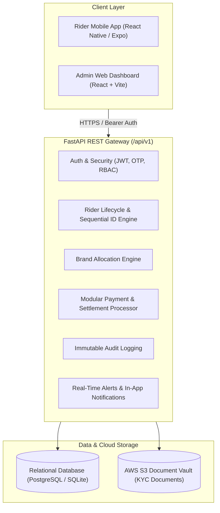

# Super Riders — Platform Architecture & Technical Design

## 1. Executive Summary

**Super Riders** is an enterprise-grade rider fleet management and payout tracking platform designed for multi-brand logistics operations. It empowers operations teams to onboard, verify, and allocate delivery riders across corporate brand partners, while ensuring transparent payout tracking and full auditability.

---

## 2. Core System Components



---

## 3. Rider Lifecycle State Machine

A rider follows a deterministic status transition:

```text
               [Rider Registers]
                       ↓
                   [PENDING]
                 ↙           ↘
    [Admin Approves]       [Admin Rejects]
           ↓                      ↓
       [APPROVED]            [REJECTED]
           ↓
   [Brand Assigned]
           ↓
        [ACTIVE] ⇄ [Admin Suspends] ⇄ [SUSPENDED]
```

### Business Rules Enforced by Backend:
1. **Sequential Rider ID**: Generated atomically in the format `SR-000001`, `SR-000002`, `SR-000145`.
2. **Approval Gate**: A newly registered rider enters `PENDING` status. They cannot take orders or receive payouts until approved by an Operations Admin or Super Admin.
3. **Brand Activation Gate**: Approving a rider transitions them to `APPROVED`. They only transition to `ACTIVE` once assigned to a client brand partner (e.g. Brand A).
4. **Audit Immutability**: Every administrative action (approval, rejection, suspension, brand assignment, payout trigger) generates an immutable `audit_logs` record containing administrator email, timestamp, IP address, and operation payload.

---

## 4. Payment & Payout Architecture

The payment system follows a 2-stage settlement model:
1. **Record Creation**: Admin or automated billing engine creates payout records with status `PENDING`, referencing Rider ID, brand, amount, period, and UPI ID.
2. **Execution & Settlement**:
   - Payout gateway adapter (RazorpayX / Cashfree / simulated adapter) receives the transaction request.
   - Upon execution confirmation, a unique Transaction ID (`TXN...`) is stamped and status changes to `PAID`.
   - If rejected by the banking partner or UPI server, status moves to `FAILED` with a documented failure reason.
   - The rider instantly receives an in-app push notification with transaction details.

---

## 5. Security & Role-Based Access Control (RBAC)

The backend enforces strict permission scopes:
- **`SUPER_ADMIN`**: Full platform control, admin user provisioning, brand settings, payouts, audit logs.
- **`OPERATIONS_ADMIN`**: Rider review, document inspection, approval/rejection queue, brand allocations.
- **`FINANCE_ADMIN`**: Payout ledger management, UPI settlement processing, financial reports.
- **`RIDER`**: Restricted strictly to their own profile, document uploads, and payment ledger (`/riders/me`).
