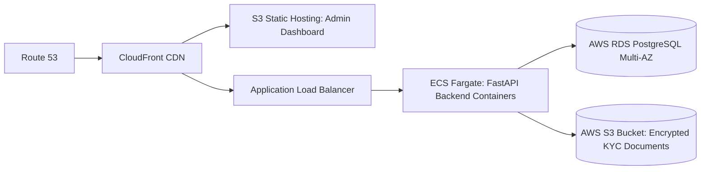

# Production AWS Deployment Guide — Super Riders Platform

## 1. Infrastructure Overview



---

## 2. Dockerizing FastAPI Backend

Create `backend/Dockerfile`:
```dockerfile
FROM python:3.11-slim

WORKDIR /app

ENV PYTHONDONTWRITEBYTECODE 1
ENV PYTHONUNBUFFERED 1

RUN apt-get update && apt-get install -y gcc libpq-dev && rm -rf /var/lib/apt/lists/*

COPY requirements.txt .
RUN pip install --no-cache-dir -r requirements.txt

COPY . .

EXPOSE 8000

CMD ["uvicorn", "app.main:app", "--host", "0.0.0.0", "--port", "8000", "--workers", "4"]
```

Build and push to Amazon ECR:
```bash
aws ecr get-login-password --region ap-south-1 | docker login --username AWS --password-stdin <ACCOUNT_ID>.dkr.ecr.ap-south-1.amazonaws.com
docker build -t super-riders-api ./backend
docker tag super-riders-api:latest <ACCOUNT_ID>.dkr.ecr.ap-south-1.amazonaws.com/super-riders-api:latest
docker push <ACCOUNT_ID>.dkr.ecr.ap-south-1.amazonaws.com/super-riders-api:latest
```

---

## 3. Database: AWS RDS PostgreSQL

1. Provision an **Amazon RDS PostgreSQL** instance (`db.t4g.medium` or higher for production).
2. Configure Multi-AZ for high availability.
3. Update environment variable in AWS Secrets Manager:
   ```env
   DATABASE_URL=postgresql://sr_db_user:<SECURE_PASSWORD>@super-riders-db.ap-south-1.rds.amazonaws.com:5432/super_riders
   ```

---

## 4. Frontend Admin Dashboard Hosting (S3 + CloudFront)

1. Build static production bundle:
   ```bash
   cd frontend && npm run build
   ```
2. Sync to S3:
   ```bash
   aws s3 sync dist/ s3://super-riders-admin-web --delete
   ```
3. Invalidate CloudFront cache:
   ```bash
   aws cloudfront create-invalidation --distribution-id <DIST_ID> --paths "/*"
   ```

---

## 5. Security & SSL

- Attach AWS Certificate Manager (ACM) free SSL wildcard certificate to CloudFront and Application Load Balancer.
- Enforce HTTP to HTTPS redirection.
- Store all secrets (`JWT_SECRET`, database credentials, payment API keys) in **AWS Secrets Manager** or **AWS Systems Manager Parameter Store**.
