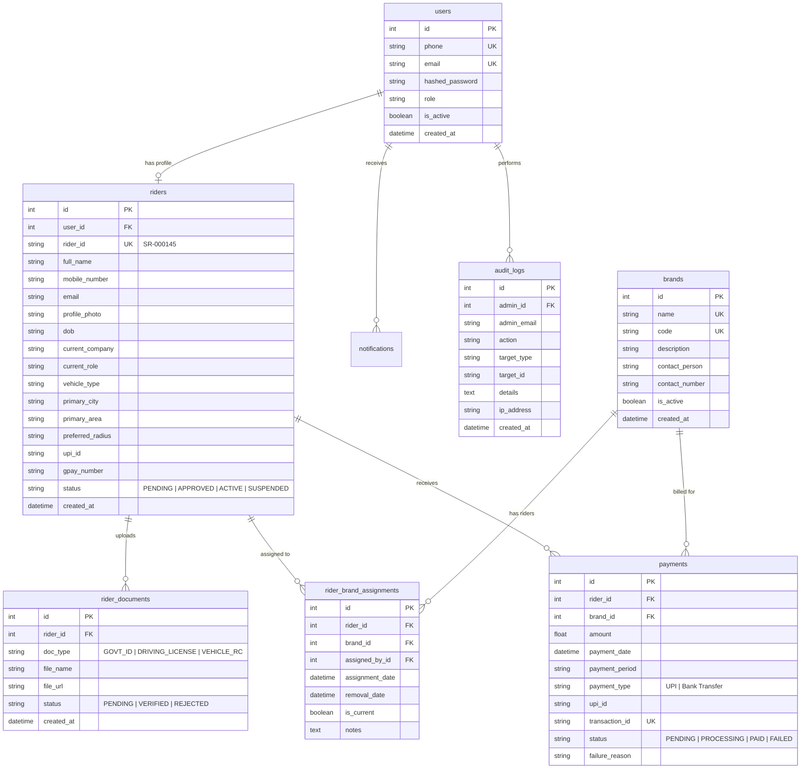

# Super Riders — Relational Database Schema Specification

## Entity Relationship Overview

The database is built on relational standards supporting PostgreSQL in production and SQLite in zero-config development environments.

